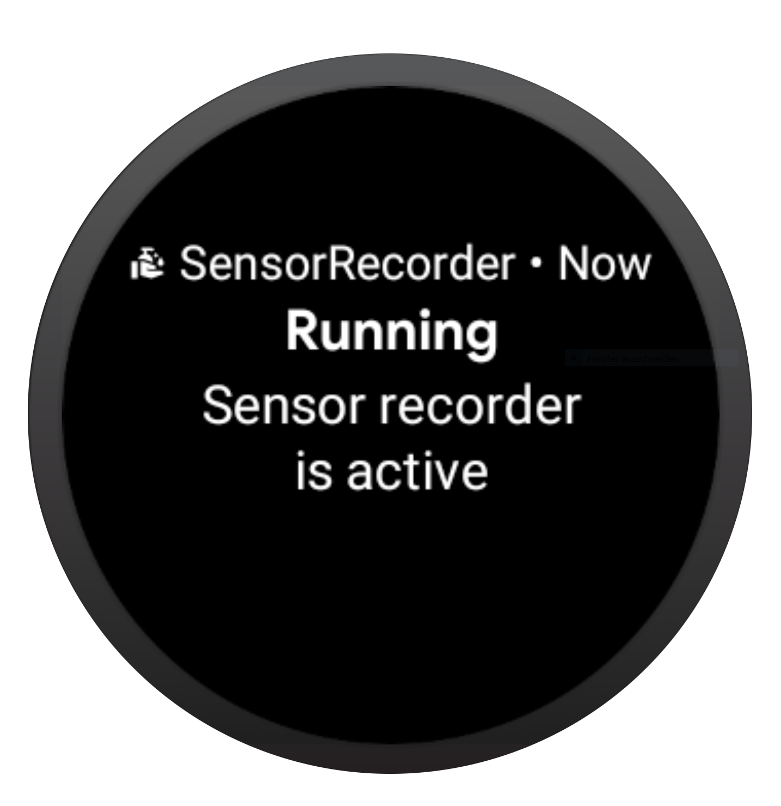
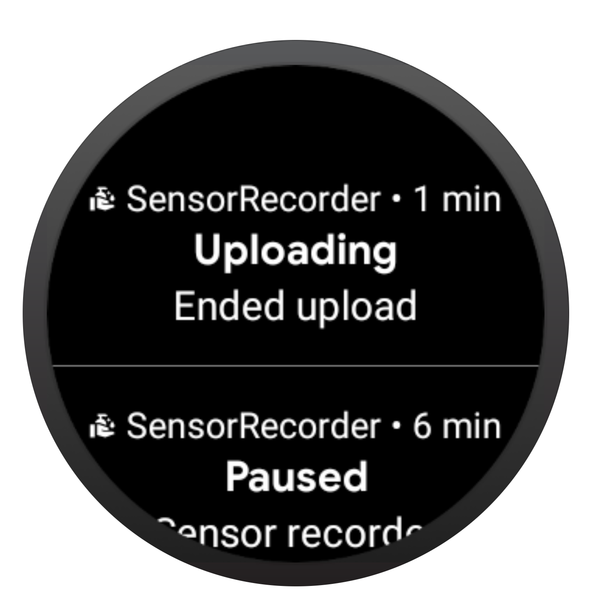
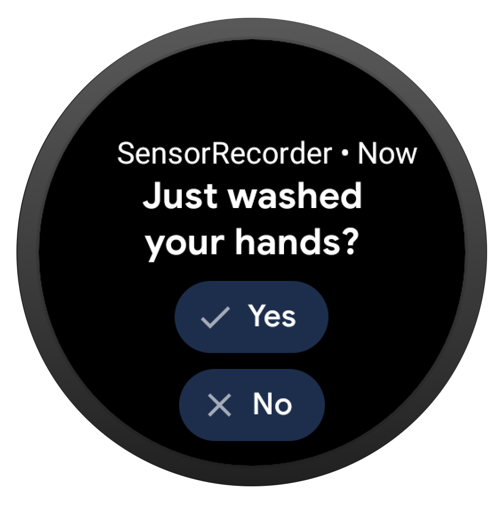
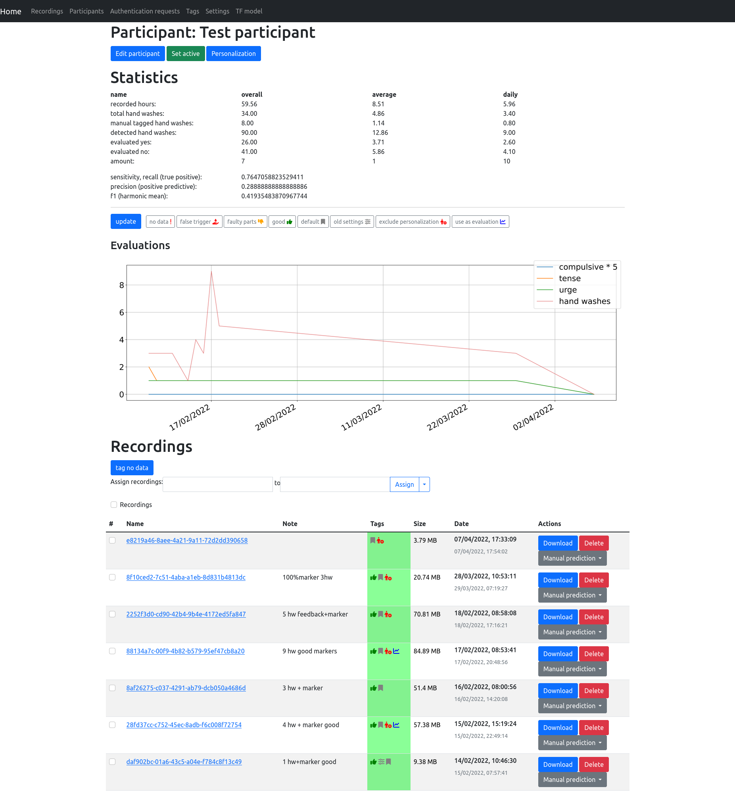
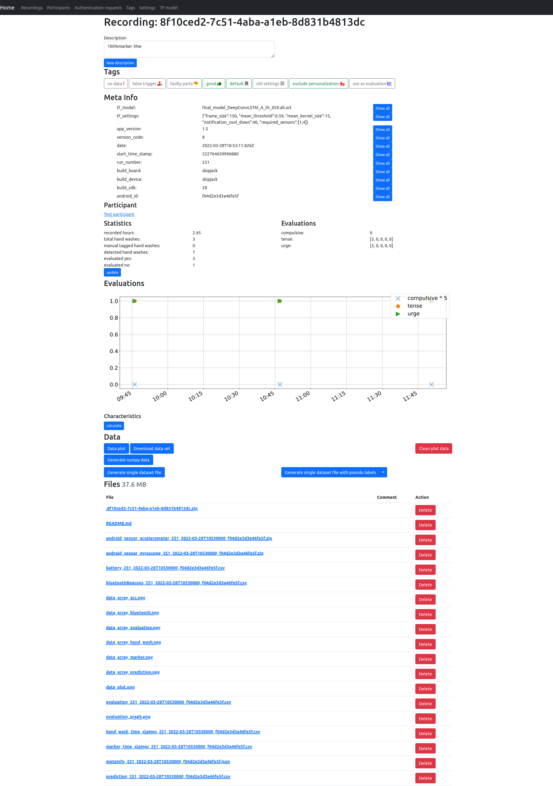
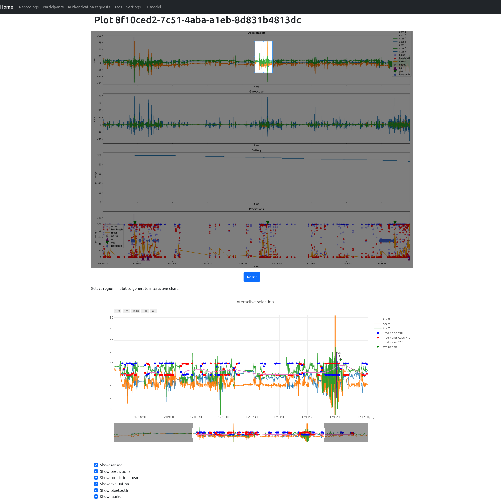

# Data recording infrastructure of obsessive hand washing

Obsessive hand washing can be harmful to the skin. Therefore we need a way to detect this process. Since Smart watches are available to a wide range of users we can use their internal sensors to observe their movements. With help of machine learning its possible to detect hand wash gestures out of this movements. This requires lots of data for training.

We want to use these smart watches to also record and deliver all movement data so that they can be used for further training. This should be happen on a daily base without much user interaction.

## Deliverables
- Wear OS application which is executed in background. This records all sensor data while the watch is disconnected from charging dock. Until the watch is charged, the recording stops and is uploaded to a webserver.
- Webserver which collects all incoming recording sessions and offers a overview and evaluation of recordings.
- Uses tflite or onnx runntime models to detect hand wash gestures and notifies the user.

# Smart watch application
The sensor recording application is executed in background. Idea has been, that no user interaction is required for the core concept. Therefore also the upload process is triggered automatically if the watch is charged.

Furthermore the application is able to detect hand washing activities. For each detection, a notification is prompted, where the user can confirm or decline. A confirmation leads to a short survey to evaluate the users condition.

# Web interface
The web interface provides an overview of all uploaded recordings and additional features to organize them.

## Participant
A participant can be created with an android id and alias. All recordings from a device with this android id are assigned to the specific participant.

For each participant some statistics are generated, like average hand washings per day or rating.

## Recording
The recording entry contains all data and information of an recording. There are also options to generate certain data set files.

## Interactive data plot
To observe a recording without downloading, an interactive data plot can be generated. Due to performance optimizations the whole graph is generated in advance and regions can be selected for an interactive part.

